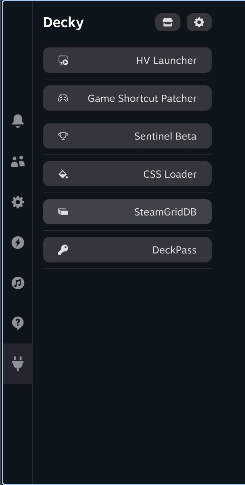
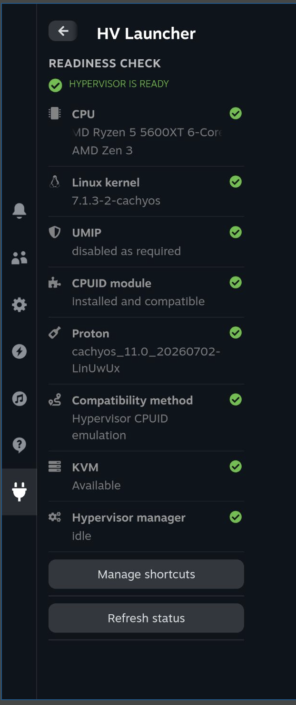
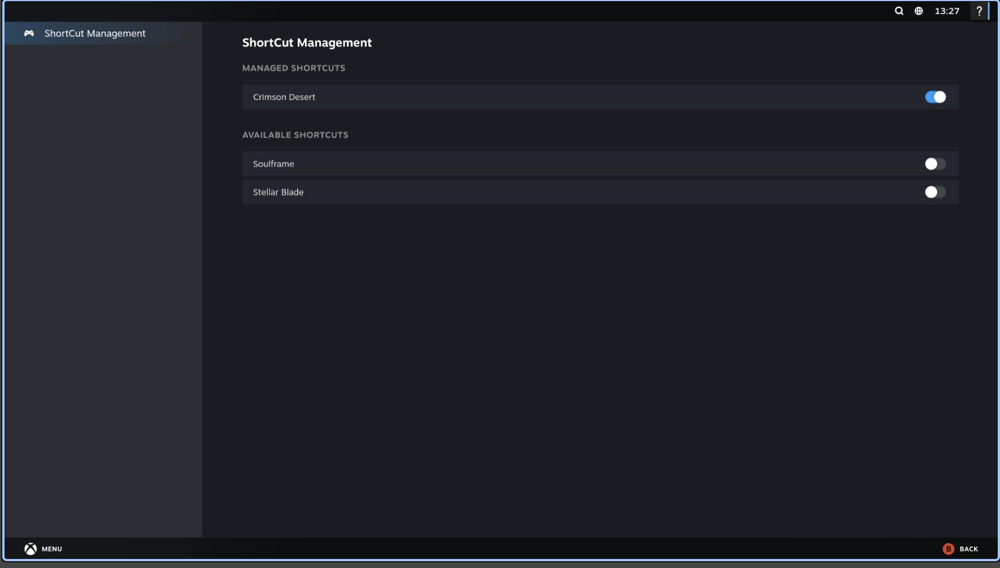
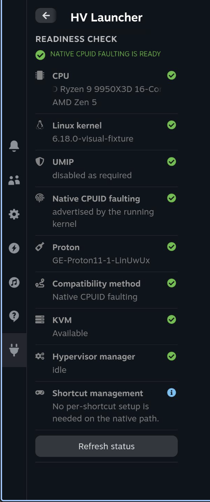
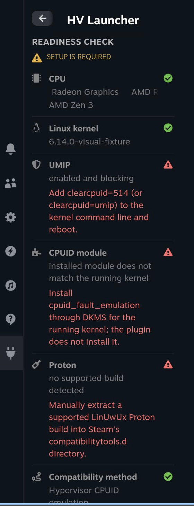
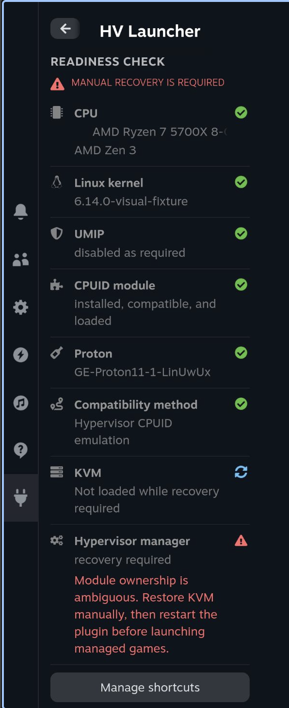
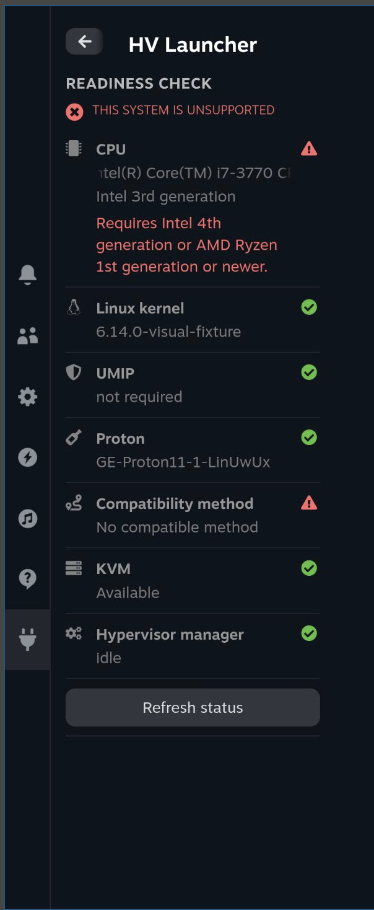

# HV Launcher

HV Launcher is a Decky Loader plugin that checks whether your system is ready to run supported HV game releases and manages the hypervisor when required on supported devices.

## Screenshots

<p align="center">
  
  &nbsp;&nbsp;
  
</p>

<p align="center">
  
</p>

<details>
<summary>More readiness states</summary>

| Native support ready | Setup required |
|:---:|:---:|
|  |  |

| Recovery required | Unsupported system |
|:---:|:---:|
|  |  |

</details>

### Installation

1. Download the latest `hv-launcher-v*.zip` from the [Releases page](https://github.com/RemakeCode/hv-launcher/releases).
2. Open Decky Loader's developer options on the device.
3. Choose the option to install a plugin from a ZIP file and select the downloaded archive.

Once installed, open HV Launcher in the Quick Access Menu to check whether your system is ready. Use Shortcut Management to choose which non-Steam game shortcuts HV Launcher should manage.

### System support

- Intel 4th generation or newer is supported on Linux 6.0 or newer.
- AMD Ryzen Zen 1–3 processors and Steam Deck-class APUs require the CPUID module.
- AMD Ryzen Zen 4 or newer can use built-in kernel support on Linux 6.18 or newer. Earlier supported kernels require the CPUID module.
- Older processors and Linux kernels below 6.0 are not supported.

HV Launcher detects the appropriate method and shows it in the readiness panel; you do not need to choose one yourself.

### Readiness setup

The Readiness details and setup page guides the supported setup steps:

- Proton: choose the archive you obtained, review the Steam installation, and confirm the source before installing. HV Launcher checks the archive structure but cannot prove where it came from. Existing Proton folders are never overwritten. Restart Steam after a successful install so it can discover the new tool.
- UMIP: supported Limine and GRUB configurations can be updated after confirmation. The change takes effect only after a reboot, and the readiness check remains blocked until the running system reports UMIP disabled. Unsupported bootloaders require manual setup. HV Launcher does not automatically undo a bootloader change.
- CPUID module: choose the `cpuid_fault_emulation` ZIP you obtained and review the exact host dependency transaction, if one is available. The module is built for the running kernel through DKMS. If that module/version is already registered, HV Launcher stops without replacing it. DKMS executes the reviewed `Makefile` as root, so continue only when you trust the source. Secure Boot or kernel lockdown may still require manual signing or MOK enrollment.

Supported mutable package families are CachyOS/Arch, Debian/Ubuntu/Mint, and Fedora/Nobara. Immutable or other distributions receive manual guidance instead of an automatic package transaction.

**For systems outside the supported guided paths, HV Launcher checks these items but does not install or change them for you.**

### Stored data

HV Launcher stores its game settings at `$XDG_DATA_HOME/hv-launcher/config.json`, or `~/.local/share/hv-launcher/config.json` when `XDG_DATA_HOME` is not set.

### Viewing logs

Follow the Decky Loader logs, including messages from HV Launcher, with:

```sh
journalctl -u plugin_loader -f
```

### Disable and uninstall

Turn off management for every game before uninstalling. This lets HV Launcher restore each shortcut to its original state. If a shortcut was changed or recreated after it was enabled, HV Launcher keeps the newer value and removes its stale management record instead of overwriting the shortcut.

If you uninstall the plugin first, reinstall it and turn off management for each game before removing it again. Advanced users can restore the Steam launch values manually before deleting `~/.local/share/hv-launcher`.

## How it works

### CPU support methods

When the kernel provides CPUID faulting directly, HV Launcher does not need to change any system modules when a game starts.

On systems that need emulation, HV Launcher performs these steps for a managed game:

1. Temporarily unload the AMD KVM modules.
2. Load and check the CPUID fault emulation module.
3. When the last managed game closes, unload emulation and restore the KVM modules.

### Game lifecycle

Enabling a shortcut saves its current Steam launch options before adding HV Launcher. The shortcut target and working directory are not changed.

When the game starts, a small launcher prepares the required CPU support and then runs the shortcut's original command. It stays active until the launcher or game closes so that Steam's normal `Play -> Launching -> Stop -> Play` behaviour is preserved. Heroic and Lutris shortcuts work as long as the process started by Steam remains open for the lifetime of the game.

If HV Launcher is unavailable, the shortcut still runs its original command without emulation. If HV Launcher is available but cannot safely prepare the system—for example, because KVM is in use—the game does not start and an error is reported.

### Module ownership and recovery

HV Launcher never stops virtual machines. It records which module changes it made so it can safely restore them after a game or restart. If it cannot determine who made a change, it reports that recovery is required instead of changing the system. It also leaves CPUID emulation alone when it was already active before HV Launcher started.

### Local setup boundary

Setup requests stay on the device and use fixed operations. Proton archive work runs with the Decky user's permissions. Bootloader, package, and DKMS changes require an explicit one-use confirmation from the plugin and cannot be turned into arbitrary commands or module names by a local request. Structural archive checks improve safety but do not replace trusting the source you selected.

### Development

Build requirements are Task, Go 1.23+, Node.js, and npm. Air is only required for the live Linux development workflow described below.

```sh
npm install
task test
task package
```

`task package` builds the frontend and Linux amd64 Go binary, then creates `package/hv-launcher.zip`. The archive contains one `hv-launcher/` plugin directory with `plugin.json`, the ESM marker in `package.json`, `main.py`, `dist/`, and `bin/hv-launcher`, ready for Decky Loader installation.

For live Linux development, also install [Air](https://github.com/air-verse/air), then run `task dev`. Task deploys to `$HOME/homebrew/plugins/hv-launcher`. Air watches the Go backend while Task watches the frontend and plugin metadata. Successful builds recreate `package/hv-launcher` and deploy it with `sudo rsync`.

```sh
task dev
```

The watcher uses non-interactive sudo. Add a narrowly scoped `visudo` rule for the exact `/usr/bin/rsync -a --delete <absolute-repository-path>/package/hv-launcher/ <decky-plugin-path>/` command before starting it. The watcher does not reload Decky Loader automatically.

#### QAM visual fixtures

Build the frontend with spoofed readiness data to inspect QAM states on the real Decky UI without changing the backend:

```sh
task frontend:visual FIXTURE=hypervisor-ready
task deploy
```

Available fixtures are `native-ready`, `native-intel7`, `z1-extreme`, `z1-extreme-native`, `hypervisor-ready`, `setup-required`, `recovery-required`, and `unsupported`. The fixture affects only QAM status and configuration requests; shortcut management continues to use the backend. Run `task frontend` (or any normal build) and deploy again to disable the fixture.

Readiness workspace process fixtures are also available when building with `FIXTURE=proton-confirm`, `FIXTURE=proton-installing`, `FIXTURE=proton-success`, `FIXTURE=umip-choice`, `FIXTURE=umip-existing`, `FIXTURE=module-review`, `FIXTURE=module-installing`, `FIXTURE=module-success`, `FIXTURE=module-signing`, `FIXTURE=module-failure`, or `FIXTURE=module-manual`.
