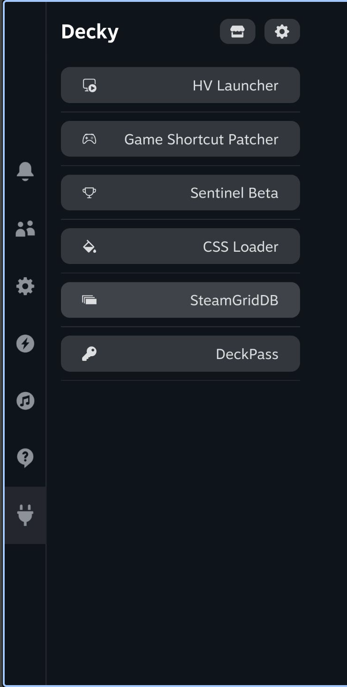
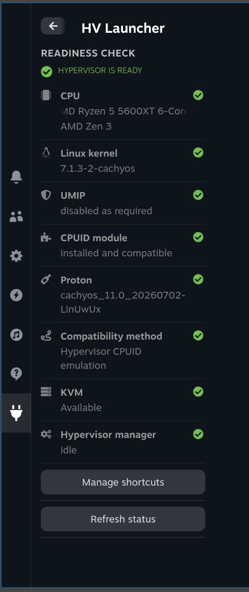
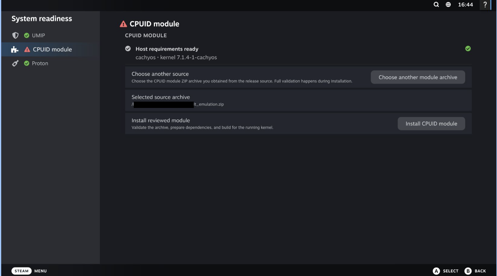
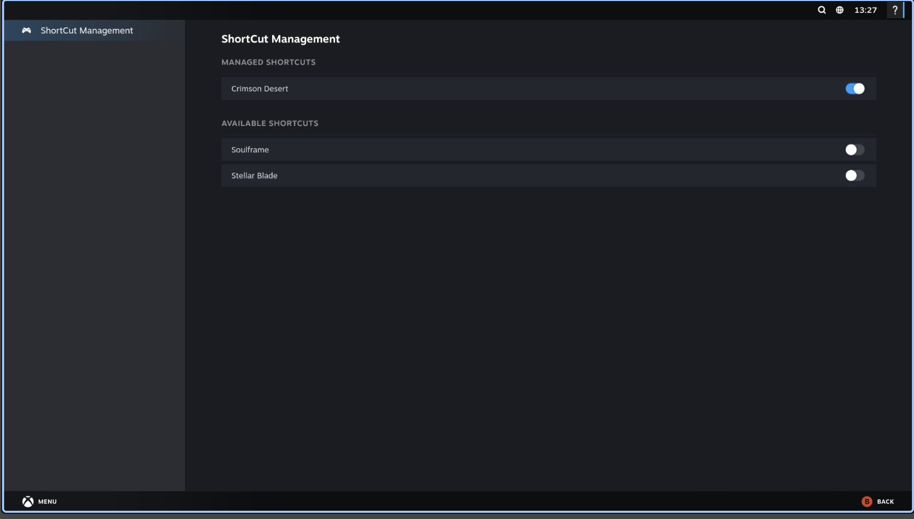
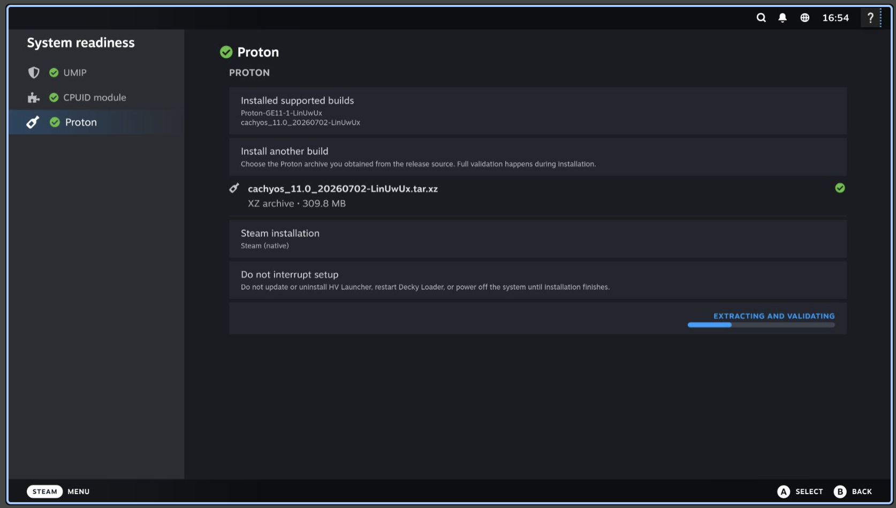
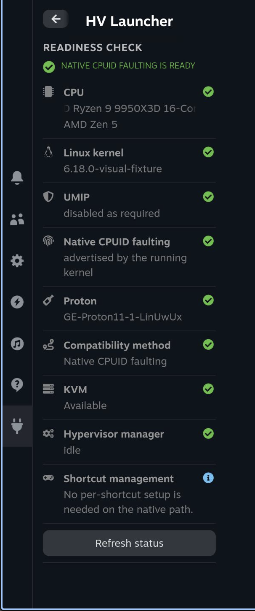
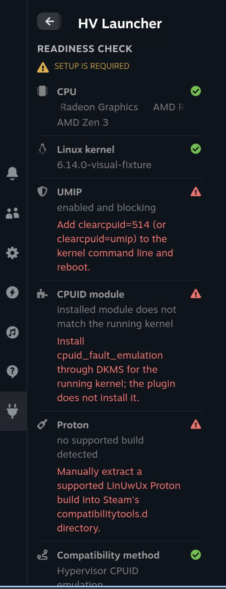
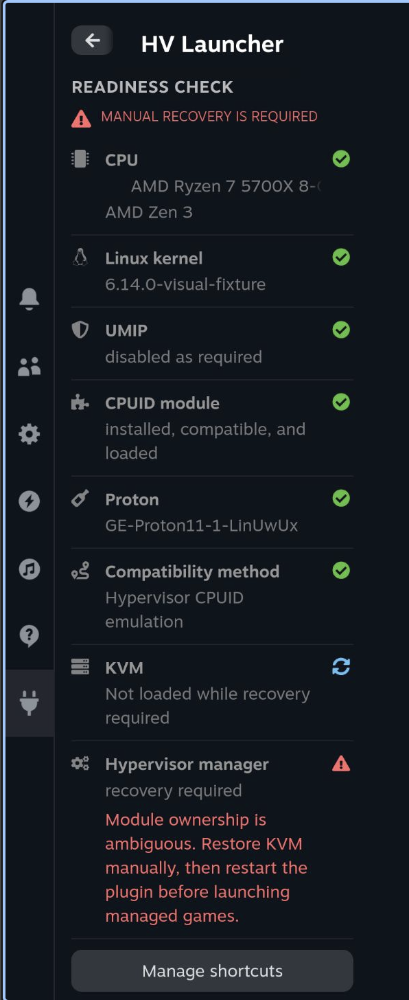
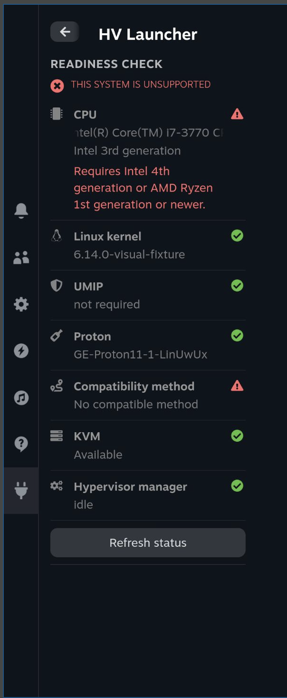

# HV Launcher

HV Launcher is a Decky Loader plugin that checks whether your system is ready to run supported HV game releases and manages the hypervisor when required on supported devices.

## Features

- Checks whether your system is ready.
- Guides Proton, UMIP, and CPUID module setup.
- Manages only the non-Steam game shortcuts you choose.
- Starts and stops the hypervisor around managed games when required.

## Screenshots

<p align="center">
  
  &nbsp;&nbsp;
  
</p>

<p align="center">
  
</p>

<p align="center">
  
</p>

<details>
<summary>More readiness states</summary>

<p align="center">
  
</p>

| Native support ready | Setup required |
|:---:|:---:|
|  |  |

| Recovery required | Unsupported system |
|:---:|:---:|
|  |  |

</details>

## Installation

Before starting, obtain:

- A compatible LinUwUx Proton archive.
- The `cpuid_fault_emulation.zip` archive if your system requires the CPUID module.

HV Launcher does not download these files for you. Only use archives obtained from a source you trust.

1. Download the latest `hv-launcher-v*.zip` from the [Releases page](https://github.com/RemakeCode/hv-launcher/releases). Do not extract it.
2. Open Decky Loader and go to **Settings → Developer**.
3. Choose **Install Plugin from ZIP** and select the downloaded HV Launcher archive.
4. Open the Quick Access Menu and select **HV Launcher**.
5. If setup is required, open **Readiness details and setup** and select the item you want to configure.
6. When the system is ready, open **Manage shortcuts** and enable the non-Steam game shortcuts you want HV Launcher to manage.

Some setup changes require restarting Steam or rebooting the system before readiness can pass.

## System support

- Intel 4th generation or newer is supported on Linux 6.0 or newer.
- AMD Ryzen Zen 1–3 processors and Steam Deck-class APUs require the CPUID module.
- AMD Ryzen Zen 4 or newer can use built-in kernel support on Linux 6.18 or newer. Earlier supported kernels require the CPUID module.
- Older processors and Linux kernels below 6.0 are not supported.

HV Launcher detects the appropriate method; you do not need to choose one yourself. Systems outside the guided setup paths receive manual instructions.

## Viewing logs

Follow the Decky Loader logs, including messages from HV Launcher, with:

```sh
journalctl -u plugin_loader -f
```

## Disable and uninstall

Turn off management for every game before uninstalling. This lets HV Launcher restore each shortcut to its original state. If a shortcut was changed or recreated after it was enabled, HV Launcher keeps the newer value and removes its stale management record instead of overwriting the shortcut.

If you uninstall the plugin first, reinstall it and turn off management for each game before removing it again. Advanced users can restore the Steam launch values manually before deleting `~/.local/share/hv-launcher`.

## Some Technical details and development

See [Technical details](TECHNICAL.md) for the guided setup behavior, game lifecycle, module recovery model, local setup boundary, build instructions, and visual fixture workflow.
